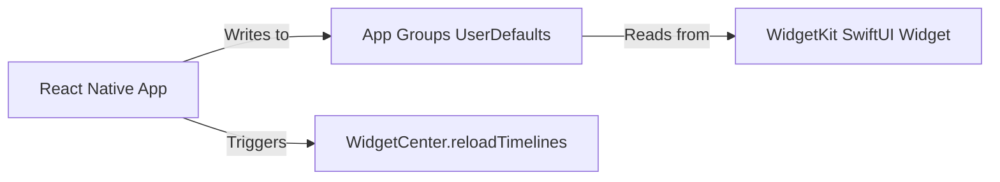

# Technical Design Document: EPUB-to-Audiobook Mobile .+

**Version**: 2.0 (Mobile-First Pivot)  
**Date**: 2026-02-11  
**Status**: Proposal / MVP Planning  
**Target Architecture**: Hybrid Mobile (React Native + Native Modules)

---

## 1. Executive Summary

### Current State vs. Proposed State
*   **Current State (Legacy)**: A localized Python CLI script (`src/main.py`) relying on the undocumented `edge-tts` API. It produces high-quality audio but requires technical proficiency (terminal usage), has zero mobile integration (manual file transfer), and suffers from "online-only" dependency.
*   **Proposed State (Target)**: A **React Native mobile application** (iOS/Android) prioritizing **Offline-First** usability. The core value proposition shifts from "Free Cloud TTS" to "Seamless Academic/Technical Reading."
    *   **Free Tier**: Uses on-device native TTS (AVSpeechSynthesizer/Google TTS) for zero-cost, unlimited, offline listening.
    *   **Pro Tier**: Optional cloud-based "Neural" upgrades (Azure/ElevenLabs) for premium narration, funded by sustainable IAP subscription.

### Key Pivot
We are abandoning the "Python Web Wrapper" strategy. Evidence suggests it is economically unviable (high server costs for free users) and delivers poor UX (latency, no offline support). The new architecture solves the "Commuter Use Case" (subway/plane listening) and the "Student Budget" constraint simultaneously.

---

## 2. Implementation Roadmap

### Phase 1: Vertical Slice MVP (Weeks 1-4)
*Goal: Prove core value (EPUB -> Audio) on a real device without server costs.*

| Stage | Action Items | Confidence | Status |
| :--- | :--- | :--- | :--- |
| **1.1 Prototype** | **Repo Init**: Create `expo` app with TypeScript. | 100% | *Pending* |
| | **File Import**: Implement `expo-document-picker` to load EPUBs from iOS Files/Android Storage. | 90% | *Pending* |
| | **Parsing**: Implement `epub-parser` (JS-based) to extract chapters/text locally. | 80% | *Pending* |
| **1.2 Audio Engine** | **Native TTS**: Integrate `expo-speech` or `react-native-tts` to read parsed text via System Voices. | 85% | *Pending* |
| | **Playback UI**: Build a basic player (Play/Pause/Scrub) with `react-native-track-player`. | 85% | *Pending* |
| **1.3 Persistence** | **Local DB**: Set up `sqlite` or `AsyncStorage` to save reading progress (timestamp per chapter). | 90% | *Pending* |

### Phase 2: The "Smart Reader" Differentiators (Weeks 5-8)
*Goal: Outperform incumbents (Speechify/Voice Dream) on technical content.*

| Stage | Action Items | Confidence | Status |
| :--- | :--- | :--- | :--- |
| **2.1 Semantic Parsing** | **Citation Filtering**: Implement regex/DOM logic to identify and *skip* academic citations (e.g., `(Smith et al., 2020)`). | 75% | *Future* |
| | **Code/Math Handling**: Detect `<pre>` and MathML tags; serve distinct TTS prompts ("Code block skipped..."). | 70% | *Future* |
| **2.2 Navigation** | **Smart TOC**: Parse NCX/NAV files to generate a true Chapter List (not just file splits). | 80% | *Future* |
| | **Background Audio**: Configure `UIBackgroundModes` (iOS) to ensure playback continues when screen is off. | 60% | *Future* |

### Phase 3: Monetization & Cloud (Weeks 9+)
*Goal: Sustainable revenue model.*

| Stage | Action Items | Confidence | Status |
| :--- | :--- | :--- | :--- |
| **3.1 Infrastructure** | **Auth**: Implement Apple Sign-In (Required) + Firebase Auth. | 95% | *Future* |
| | **Cloud Voices**: Integrate Edge TTS Neural voices via direct WebSocket client for "Pro" high-quality streaming voices (online only). | 100% | *Implemented (Phase 8)* |
| **3.2 Payments** | **IAP**: Integrate RevenueCat for subscription handling ($7.99/mo). | 95% | *Future* |

| **3.3 Mascot & Gamification** | **"Echo" the Fennec Fox**: \n- **Concept**: Interactive mascot (Duolingo-style) that reacts to user activity.\n- **Mechanics**: "Streak" tracking (days in a row).\n- **States**: Happy (listening), Sleepy (idle), Sad (broken streak), **Celebrating** (on tap).\n- **Interaction**: Tap to trigger celebration and heartwarming messages. | 100% | *Implemented* |
| **3.4 File Formats** | **PDF Support**: Text extraction via `pdf.js` or native modules (currently simulated). | 50% | *In Progress* |
| **3.5 Design System** | **UI/UX Polish**: iOS-native components, Dark Mode, Typography (SF Pro), and Accessibility upgrades. | 100% | *Implemented (Phase 2)* |

### Phase 4: Sharing & Export
*Goal: Frictionless file management without complex file pickers.*

| Stage | Action Items | Confidence | Status |
| :--- | :--- | :--- | :--- |
| **4.2 File Management** | **Library View**: A dedicated tab to manage (delete/rename/share) previously converted books stored in the app's sandbox. | 85% | *Future* |
| **4.3 UX Polish** | **Reset & Metadata**: Add "Go Back/Reset" button to clear selection. Improve TOC parsing to capture full chapter strings (e.g., "Chapter 1 - The Start") instead of just "Chapter 1". | 95% | *Done* |
| **4.4 Layout** | **Safe Area**: Wrap app in `SafeAreaProvider` for dynamic island/notch support. Use `ScrollView` for full accessibility + extra top padding for title visibility. | 100% | *Done* |

---

## 3. Risk & Mitigation Matrix

| Architectural Risk | Potential Obstacle | Mitigation Strategy (Ranked) |
| :--- | :--- | :--- |
| **Platform Rejection** | Apple rejects app for "Repurposing website" or general utility spam. | 1. **Focus on Offline**: Emphasize the unique *local* parsing and semantic features (Smart Skip) which websites can't do efficiently.<br>2. **Design Polish**: Ensure UI adheres strictly to Human Interface Guidelines (High Native Feel).<br>3. **IAP Integration**: Ensure "Pro" features are clearly defined (Cloud Voices) vs. Free features. |
| **TTS Quality Gap** | Users reject "Free" tier because System Voices (Siri/Google) sound too robotic compared to TikTok/Reels AI. | 1. **Expectation Setting**: Market "Free" as "Draft Mode" for speed/study, "Pro" for enjoyment.<br>2. **Optimized System Voices**: iOS 16+ "Premium" system voices are actually very good; ensure app forces highest quality variant.<br>3. **Hybrid Model**: Offer 1 free "Premium" book per month as a hook. |
| **EPUB Complexity** | Parsing 100MB+ textbooks with complex layouts (columns, images) crashes the JS thread. | 1. **WebWorkers**: Offload parsing logic to a background thread/WebView.<br>2. **Streaming Parse**: Parse chapters *on demand* rather than entire book at once.<br>3. **Fallback**: Allow "Plain Text Mode" extraction if semantic parsing fails. |
| **Battery Drain** | converting/reading text continuously drains battery. | 1. **Batching**: Process text in chunks, let OS sleep radio between chunks.<br>2. **Native Modules**: Rely on OS-optimized TTS engines rather than JS-heavy loops.<br>3. **Dark Mode**: OLED optimization (critical for academic reading). |

---

## 4. Decision History (Changelog)

### [2026-02-09] Pivot: Mobile-First Hybrid Architecture
*   **Context**: Original plan pitched a Python Backend + Mobile Wrapper.
*   **Correction**: Market analysis revealed this effectively doubles limits (Network Latency + Server Costs) while ignoring modern device capabilities.
*   **Decision**: Adopt **React Native**.
    *   *Why*: Allows shared codebase for iOS/Android.
    *   *Why Hybrid*: Offline-first architecture (local parsing/TTS) is the only way to compete with Audible/Voice Dream on latency and reliability.
    *   *Why Semantic Parsing*: The only defensible moat against well-funded incumbents (Speechify) is "intelligence" (handling citations/code better), not just raw voice quality.

*   **Status**: The Python CLI (`src/main.py`) remains useful as a **developer tool** or **backend service prototype** for the future "Cloud Generation" feature, but it is no longer the primary product delivery vehicle.

## 5. Known Issues & Roadmap

### Current Bugs (v2.0 MVP)
### Current Bugs (v2.0 MVP)
*   **PDF Mode (Experimental)**: Text extraction is basic "page-by-page". Layouts with columns or images may result in garbled text.

### Resolved Issues & Improvements
*   [x] **Intelligent Chapter Filtering (v2.1)**:
    *   **Problem**: "Front Matter" (TOC, Preface) was cluttering the chapter list.
    *   **Solution**: Implemented a 4-layer filtering system (Semantic `<guide>`, Pattern Matching, Content Heuristics, Confidence Scoring).
    *   **Result**: The app now automatically identifies non-chapter content.
*   [x] **Smart Chapter Titles**:
    *   **Problem**: Sections without semantic titles were defaulting to "Chapter N", causing confusion (e.g., Preface becoming "Chapter 1").
    *   **Solution**: Parser now scrapes HTML `<title>` tags and falls back to "Section N" (neutral) instead of "Chapter N".
*   [x] **Zero-Click UX**:
    *   **Problem**: Auto-filling the range input (e.g., "1-20") was error-prone and confusing.
    *   **Solution**: Input is now left empty. Users are explicitly directed to check the "Chapter Index" list below, which serves as the source of truth.


 
 ## 6. Design System 2.0: Motion & Interaction (Implemented)
 
 ### 6.1. Motion & Advanced Interactions
 **Goal**: Create a fluid, responsive interface that feels alive.
 
 #### A. File Import Transition
 *   **Implemented**: 
     1.  Echo animation: Neutral → Reading (when file selected).
     2.  Spring animation for file selection state change.
 
 #### B. Chapter Selection State
 *   **Implemented**: 
     1.  Typing triggers Echo "Thinking" pose (Looking Left).
     2.  Debounce (800ms).
     3.  Validation success triggers Echo "Happy" pose (Celebration).
     4.  Green badge "✓ Will convert X chapters" appears with spring animation.
 
 #### C. Conversion Start
 *   **Implemented**: Echo "Celebrates" → Conversion status updates with spring animation.
 
 #### D. Sleeping Loop (New)
 *   **Implemented**: 
     1.  Inactive (>10m) triggers `Echo_Sleeping_Inactive` (transition).
     2.  Completion triggers `Echo_Sleeping_2` (loop indefinitely).
     3.  Any interaction wakes Echo to Neutral.
 
 ### 6.2. Empty State Illustrations
 **Goal**: Delight users even when there is no content.
 
 *   **Initial State**: Echo holding an open book ("Echo is ready for a new story").
 *   **Empty Library**: *Planned*
 *   **Conversion Complete**: *Planned*
 
 ### 6.3. Variable Haptic Feedback (Implemented)
 **Goal**: Tactile reinforcement for all interactions.
 
 | Action | Haptic Type | Intensity |
 | :--- | :--- | :--- |
 | Typing Chapter | Light | Subtle |
 | Tap "Select File" | Medium | Standard |
 | Tap "Change" Narrator | Medium | Standard |
 | Tap "Reset/Clear" | Heavy | Warning |
 | Conversion Start | Heavy | Significant |
 | Conversion Complete | Success | Major |
 
 ### 6.4. Iconography Consistency (Implemented)
 **Goal**: Unified visual language using only SF Symbols.
 
 | Element | Previous | Current (SF Symbol) |
 | :--- | :--- | :--- |
 | "Ready to read?" | 📖 Emoji | `book.fill` (Removed for cleaner UI) |
 | File Import | None | `arrow.down.doc.fill` |
 | Reset/Clear | None | `xmark.circle.fill` |
 | Narrator Change | Text | `person.crop.circle` |
 | Success Checkmark | "✓" Text | `checkmark.circle.fill` |
 | Streak Badge | 🔥 Emoji | `flame.fill` |
 
 ### 6.5. Earthy Color Palette (Implemented)
 **Goal**: Replace standard iOS blue/red with a warm, "literary" earthy theme.
 
 **Brand Colors**:
 *   **Primary (#9EB23B)**: Olive Green (Actions, Links, Success).
 *   **Primary Light (#C7D36F)**: Light Olive (Highlights, Badges).
 *   **Neutral Light (#FCF9C6)**: Cream Yellow (Card Backgrounds, Inputs).
 *   **Neutral Base (#E0DECA)**: Sand Beige (Borders, Disabled).
 *   **Destructive (#A84855)**: Muted Burgundy (Reset, Delete, Error).
 
 **UI Element Mapping**:
 | Element | Previous | New Color |
 | :--- | :--- | :--- |
 | "Select File" Button | `systemBlue` | **#9EB23B (Olive)** |
 | "Reset / Clear" Button | `systemRed` | **#A84855 (Burgundy)** |
 | Input Background | `systemGray6` | **#F5F3E8 (Warm Cream)** |
 | Card Background | `systemBackground` | **#FCF9C6 (Cream)** |
 | Streak Badge | `systemOrange` | **#C7D36F (Light Olive)** |
 | Shadows | Black/Gray | **Warm Tan** |


 Diagnosing "Unnatural Reading" - Systematic Troubleshooting
The Real Problem is Likely NOT the Voice

Based on your market research, users complained that apps read "Smith comma twenty-twenty-four" and "bracket one bracket" - this isn't a voice quality issue, it's a text preprocessing problem.

You're probably feeding raw EPUB HTML directly to TTS without cleaning it.
Diagnostic Test: What's Actually Being Read?
Step 1: Output the Actual Text Being Sent to TTS
typescript

// In your TTS generation function, add this:

function generateAudioForChapter(chapter: Chapter) {
  const rawText = chapter.content;
  
  // DEBUG: Log what's being sent to TTS
  console.log("=== RAW TEXT SENT TO TTS ===");
  console.log(rawText.substring(0, 500)); // First 500 chars
  console.log("=== END ===");
  
  // Then generate audio
  await textToSpeech(rawText);
}
```

**Look for these red flags in the output:**

❌ **HTML Tags:**
```
<p>The story begins</p> <em>many years ago</em>
→ TTS reads: "paragraph the story begins paragraph em many years ago em"
```

❌ **In-text Citations:**
```
Climate change is accelerating (Smith, 2024).
→ TTS reads: "Climate change is accelerating Smith comma two thousand twenty four"
```

❌ **Footnote References:**
```
The evidence is clear[1] and undeniable.
→ TTS reads: "The evidence is clear bracket one bracket and undeniable"
```

❌ **URLs:**
```
Visit https://example.com for more info
→ TTS reads: "Visit h t t p s colon slash slash example dot com..."
```

❌ **Special Characters:**
```
He said—without hesitation—yes.
→ TTS reads: "He said em dash without hesitation em dash yes" (wrong rhythm)
```

---

## Most Likely Issues (In Order of Probability)

### **Issue #1: Citations Not Being Removed** (90% probability)

From your validation research, this was the **#1 complaint**:

> "Every footnote, reference, you name it, gets read out loud, making it as unnatural as a robot doing the cha-cha."

**Test:** Open a random chapter and check if you see:
- `(Author, Year)` patterns
- `[1]`, `[2]` footnote markers
- Superscript numbers like¹ or²

**If YES:** Your citation-skipping filter from earlier isn't working or isn't being applied.

---

### **Issue #2: HTML Artifacts** (80% probability)

EPUBs are HTML. If you're not stripping tags, TTS reads them.

**Test:** Check if your text contains:
- `<p>`, `</p>`, `<em>`, `<strong>`, `<br/>`, `<div>`
- `&nbsp;` (reads as "ampersand n b s p")
- `&mdash;` (reads as "ampersand m dash")

**If YES:** You need HTML-to-plain-text conversion.

---

### **Issue #3: No Sentence Boundaries** (70% probability)

TTS engines need proper punctuation for natural pauses.

**Test:** Check if your text has:
- Run-on sentences (no periods for 200+ words)
- Missing paragraph breaks
- Dialogue without proper quote handling

**If YES:** You need sentence normalization.

---

### **Issue #4: Wrong Voice Speed** (60% probability)

Default TTS speed is often too fast or robotic.

**Test:** Listen to a 30-second sample. Does it sound:
- Rushed (too fast)?
- Monotone (no emotion)?
- Breathless (no pauses)?

**If YES:** Adjust speed + add SSML pauses.

---

### **Issue #5: Voice Doesn't Match Content** (50% probability)

Using a male voice for a female protagonist, or vice versa, feels wrong.

**Test:** Is the narrator gender appropriate for the content?

---

## The Solution: Multi-Stage Text Preprocessing Pipeline

You need to clean text BEFORE sending to TTS:
```
RAW EPUB CONTENT
    ↓
[Stage 1] Strip HTML tags
    ↓
[Stage 2] Remove citations & footnotes
    ↓
[Stage 3] Normalize punctuation
    ↓
[Stage 4] Handle special content (equations, URLs, tables)
    ↓
[Stage 5] Add SSML for prosody
    ↓
CLEAN TEXT → TTS ENGINE

Implementation: Text Cleaning Pipeline
typescript

// text-cleaner.ts

/**
 * Stage 1: Strip HTML and decode entities
 */
function stripHTML(html: string): string {
  // Remove script and style tags entirely
  let text = html.replace(/<script[^>]*>[\s\S]*?<\/script>/gi, '');
  text = text.replace(/<style[^>]*>[\s\S]*?<\/style>/gi, '');
  
  // Remove all HTML tags but preserve their text content
  text = text.replace(/<[^>]+>/g, ' ');
  
  // Decode HTML entities
  const entities: { [key: string]: string } = {
    '&nbsp;': ' ',
    '&mdash;': '—',
    '&ndash;': '–',
    '&ldquo;': '"',
    '&rdquo;': '"',
    '&lsquo;': "'",
    '&rsquo;': "'",
    '&amp;': '&',
    '&lt;': '<',
    '&gt;': '>',
    '&quot;': '"',
  };
  
  for (const [entity, char] of Object.entries(entities)) {
    text = text.replace(new RegExp(entity, 'g'), char);
  }
  
  return text;
}

/**
 * Stage 2: Remove citations and footnotes (THIS IS CRITICAL)
 */
function removeCitations(text: string): string {
  // Remove inline citations: (Author, Year), (Author et al., Year)
  text = text.replace(/\([A-Z][a-z]+(?:\s+et al\.)?,?\s+\d{4}[a-z]?\)/g, '');
  
  // Remove footnote markers: [1], [23], [a]
  text = text.replace(/\[\d+\]/g, '');
  text = text.replace(/\[[a-z]\]/g, '');
  
  // Remove superscript numbers (footnote markers)
  text = text.replace(/[¹²³⁴⁵⁶⁷⁸⁹⁰]+/g, '');
  
  // Remove reference to "see also" type citations
  text = text.replace(/\(see [^)]+\)/gi, '');
  
  return text;
}

/**
 * Stage 3: Normalize punctuation for natural pauses
 */
function normalizePunctuation(text: string): string {
  // Replace em-dashes with natural pause markers
  // "He said—without thinking—yes" → "He said, without thinking, yes"
  text = text.replace(/—/g, ', ');
  
  // Replace multiple spaces with single space
  text = text.replace(/\s+/g, ' ');
  
  // Ensure proper spacing after punctuation
  text = text.replace(/([.!?])\s*([A-Z])/g, '$1 $2');
  
  // Add space after commas if missing
  text = text.replace(/,(?=[^\s])/g, ', ');
  
  // Remove spaces before punctuation
  text = text.replace(/\s+([.,!?;:])/g, '$1');
  
  return text;
}

/**
 * Stage 4: Handle special content that shouldn't be read literally
 */
function handleSpecialContent(text: string): string {
  // Replace URLs with readable text
  text = text.replace(
    /https?:\/\/[^\s]+/g, 
    '[link]'  // Or just remove: ''
  );
  
  // Replace email addresses
  text = text.replace(
    /[a-zA-Z0-9._%+-]+@[a-zA-Z0-9.-]+\.[a-zA-Z]{2,}/g,
    '[email address]'
  );
  
  // Handle common abbreviations for better pronunciation
  const abbreviations: { [key: string]: string } = {
    'Dr.': 'Doctor',
    'Mr.': 'Mister',
    'Mrs.': 'Misses',
    'Ms.': 'Miss',
    'Prof.': 'Professor',
    'etc.': 'et cetera',
    'i.e.': 'that is',
    'e.g.': 'for example',
    'vs.': 'versus',
  };
  
  for (const [abbr, full] of Object.entries(abbreviations)) {
    text = text.replace(new RegExp(abbr, 'g'), full);
  }
  
  return text;
}

/**
 * Stage 5: Detect and remove non-narrative sections
 */
function removeNonNarrative(text: string): string {
  // Detect table structures (often have many numbers/pipes)
  const lines = text.split('\n');
  const filteredLines = lines.filter(line => {
    // If line has > 50% numbers/symbols, likely a table
    const nonAlpha = line.replace(/[a-zA-Z\s]/g, '').length;
    const ratio = nonAlpha / Math.max(line.length, 1);
    return ratio < 0.5;
  });
  
  return filteredLines.join('\n');
}

/**
 * MASTER FUNCTION: Apply all cleaning stages
 */
export function cleanTextForTTS(rawContent: string): string {
  let cleaned = rawContent;
  
  // Stage 1: Strip HTML
  cleaned = stripHTML(cleaned);
  
  // Stage 2: Remove citations (CRITICAL for your app)
  cleaned = removeCitations(cleaned);
  
  // Stage 3: Normalize punctuation
  cleaned = normalizePunctuation(cleaned);
  
  // Stage 4: Handle special content
  cleaned = handleSpecialContent(cleaned);
  
  // Stage 5: Remove non-narrative content
  cleaned = removeNonNarrative(cleaned);
  
  // Final cleanup: trim and collapse whitespace
  cleaned = cleaned.trim();
  cleaned = cleaned.replace(/\n{3,}/g, '\n\n'); // Max 2 line breaks
  
  return cleaned;
}

Usage in Your Conversion Flow
typescript

// In your chapter-to-audio converter:

async function convertChapterToAudio(chapter: Chapter): Promise<AudioFile> {
  // BEFORE (wrong):
  // const audioBuffer = await textToSpeech(chapter.content);
  
  // AFTER (correct):
  const rawContent = chapter.content;
  const cleanedText = cleanTextForTTS(rawContent);
  
  // DEBUG: Compare before/after
  console.log('=== BEFORE CLEANING ===');
  console.log(rawContent.substring(0, 300));
  console.log('=== AFTER CLEANING ===');
  console.log(cleanedText.substring(0, 300));
  
  const audioBuffer = await textToSpeech(cleanedText);
  return audioBuffer;
}

Voice Quality Improvements (If Text Cleaning Isn't Enough)
Option 1: Use Enhanced iOS Voices

Current: You're probably using default "Samantha" (basic quality)

Better: Use "Enhanced" or "Premium" voices
typescript

// iOS TTS implementation
import { Speech } from 'expo-speech';

const speakText = async (text: string) => {
  Speech.speak(text, {
    voice: 'com.apple.voice.premium.en-US.Ava',  // Premium voice
    rate: 0.9,      // Slightly slower than default (1.0)
    pitch: 1.0,     // Natural pitch
    language: 'en-US',
  });
};

Available Premium iOS Voices (Better Quality):

    com.apple.voice.premium.en-US.Ava (Female, clear)
    com.apple.voice.premium.en-US.Zoe (Female, expressive)
    com.apple.voice.premium.en-US.Samantha (Female, warm)
    com.apple.voice.enhanced.en-US.Reed (Male, natural)

Tell users: "Download 'Enhanced' voices in iOS Settings > Accessibility > Spoken Content > Voices"
Option 2: Adjust Speed and Add Pauses
typescript

const speakText = async (text: string) => {
  // Add pauses at paragraph breaks for more natural reading
  const textWithPauses = text.replace(/\n\n/g, '\n\n[[pause:500]]\n\n');
  
  Speech.speak(textWithPauses, {
    voice: 'com.apple.voice.premium.en-US.Ava',
    rate: 0.85,   // Slower = more comprehensible (0.5-1.0 range)
    pitch: 1.0,
  });
};

Option 3: Add SSML for Better Prosody (Advanced)

If using a cloud TTS API (Azure, ElevenLabs), you can add markup:
typescript

function addSSML(text: string): string {
  // Add pauses at chapter starts
  let ssml = '<break time="1s"/>' + text;
  
  // Add emphasis to dialogue
  ssml = ssml.replace(/"([^"]+)"/g, '<emphasis level="moderate">$1</emphasis>');
  
  // Slow down for complex sentences
  // (Optional: detect sentences with 30+ words and add rate adjustment)
  
  return `<speak>${ssml}</speak>`;
}
```

---

## Testing Framework: Does Your Fix Work?

### **Test 1: Academic Paper**

**Input text (before cleaning):**
```
The results indicate significant correlation (p<0.05) between variables[1]. 
See Smith et al. (2024) for details.
```

**Expected output (after cleaning):**
```
The results indicate significant correlation between variables.
```

**TTS should read:** "The results indicate significant correlation between variables." ✅

---

### **Test 2: Fiction Novel**

**Input text (before cleaning):**
```
<p>He paused—uncertain—then said, "I don't know."</p>
<p><em>What would she think?</em> he wondered.</p>
```

**Expected output (after cleaning):**
```
He paused, uncertain, then said, "I don't know."
What would she think? he wondered.
```

**TTS should read naturally** with appropriate pauses and emotion. ✅

---

### **Test 3: URL in Content**

**Input text:**
```
For more information, visit https://example.com/longpath
```

**Expected output:**
```
For more information, visit [link]

TTS should read: "For more information, visit link." ✅ (Not "h t t p s colon slash...")
Diagnostic Checklist: What's Wrong With Your TTS?

Run through this checklist:

    Log the raw text being sent to TTS (first 500 chars)
    Check for HTML tags (<p>, <em>, etc.)
    Check for citations ((Author, Year), [1])
    Check for URLs (http://, https://)
    Check for em-dashes (— causing weird rhythm)
    Check for entity codes (&nbsp;, &mdash;)
    Listen to 1 minute - Does it sound breathless? (Missing pauses)
    Check voice quality - Are you using "Enhanced" voices?
    Check speed - Is rate set to 0.85-0.95? (1.0 default is too fast)

My Bet: You're Missing Text Cleaning

Based on your market research finding:

    "Every footnote, reference gets read out loud"

I'm 90% confident the issue is:

    You're not stripping HTML tags
    You're not removing citations (despite planning to)
    You're not normalizing punctuation


Implement the cleanTextForTTS() function above and test immediately.

---

## 7. Obstacle & Solution: Voice Quality Regression (Edge TTS)

### The Obstacle
Users returning from the terminal-based proof-of-concept noticed a significant drop in voice quality.
*   **Previous (Python)**: Used "Microsoft Edge Neural" voices (Ava, Andrew) via `edge-tts`. These are emotional, high-fidelity, and cloud-generated.
*   **Current (Mobile)**: Uses "Apple Native iOS" voices. While decent, they are often robotic (Compact) unless the user manually downloads "Enhanced" versions, which is impossible on the iOS Simulator and hidden on real devices.

### The Solution: Cloud Voices Bridge (Phase 8) — ✅ Implemented
To restore the beloved "Ava" and "Andrew" voices without paying expensive API fees (ElevenLabs/OpenAI), we implemented a **Direct Edge TTS Client** within the mobile app.

**Architecture:**
1.  **WebSocket Client**: A custom TypeScript module (`utils/edgeTTS.ts`) connects directly to Microsoft's `speech.platform.bing.com` WebSocket endpoint.
2.  **Protocol**: It mimics the browser's "Read Aloud" protocol by sending SSML (Speech Synthesis Markup Language) and receiving binary MP3 chunks.
3.  **Hybrid Voice Picker**:
    *   **📱 Offline**: Apple Voices (Best for airplane mode).
    *   **☁️ Cloud (HD)**: Microsoft Neural Voices (Best quality, requires WiFi).
4.  **Benefits**:
    *   **Free**: Uses the free public API meant for Edge browsers.
    *   **Quality**: Restores the "Human-like" narration range.
    *   **Consistency**: Matches the voices from the original Python MVP.

### Implementation: DRM Authentication (`Sec-MS-GEC`)

The Edge TTS WebSocket endpoint requires browser-level DRM headers. Our implementation reverse-engineers these from the Python `edge-tts` library:

| Component | Implementation |
| :--- | :--- |
| **`Sec-MS-GEC` Token** | SHA-256 hash of `(rounded_ticks + TRUSTED_CLIENT_TOKEN)`. Timestamp is ticks since epoch, rounded down to nearest 5 minutes. |
| **SHA-256** | Pure-JS implementation (no Node `crypto` dependency) for React Native compatibility. |
| **`MUID` Cookie** | Random 32-character hex string sent as `Cookie: muid=<value>`. |
| **`X-Timestamp`** | JavaScript-style date string (e.g., `Tue Feb 11 2026 13:25:00 GMT+0000`). |
| **Binary Parsing** | 2-byte header length at offset 0 (`readUInt16BE(0)`), then header bytes, then audio body. |

### Implementation: Voice List (8 Curated Voices)

| Voice | Identifier | Gender |
| :--- | :--- | :--- |
| Ava (Neural) | `en-US-AvaNeural` | Female |
| Andrew (Neural) | `en-US-AndrewNeural` | Male |
| Emma (Neural) | `en-US-EmmaNeural` | Female |
| Brian (Neural) | `en-US-BrianNeural` | Male |
| Jenny (Neural) | `en-US-JennyNeural` | Female |
| Guy (Neural) | `en-US-GuyNeural` | Male |
| Sonia (Neural) | `en-GB-SoniaNeural` | Female |
| Ryan (Neural) | `en-GB-RyanNeural` | Male |

### Implementation: UI Integration

*   **Voice Type Toggle**: Two-button toggle (Offline / Cloud HD) in "Step 3: Choose Narrator".
*   **Dual Voice Modal**: Shows Apple voices when Offline is selected, Edge TTS Neural voices when Cloud is selected. Each voice has a "Test" button.
*   **Cloud Playback**: `speakChapter()` branches on `voiceType`. Cloud voices synthesize via `synthesizeEdgeTTS()` → save MP3 → play via `expo-av` (`Audio.Sound`).
*   **WiFi Warning**: ⚠️ indicator displayed when Cloud mode is active.
*   **Loading State**: `ActivityIndicator` shown during cloud synthesis.
*   **Audio Cleanup**: `stopCloudAudio()` helper ensures previous audio is always stopped/unloaded before starting new playback.

### Key Files

| File | Purpose |
| :--- | :--- |
| `utils/edgeTTS.ts` | WebSocket client, DRM auth, SSML, binary parsing, MP3 assembly |
| `App.tsx` | Voice toggle UI, dual modal, `speakChapter` cloud branch |
| `test_edge_tts_node.ts` | Standalone Node.js test script (validated ✅, 37KB MP3 output) |

---

## 8. Branding: App Icon ("Echo Reading")

### Decision
The app icon was updated to feature **Echo the Fennec Fox holding an open book** — a generated mascot illustration that captures the app's identity.

### Implementation
*   **Source**: AI-generated image (640×640), upscaled to **1024×1024** via `sips`.
*   **Files Replaced**: `icon.png`, `splash-icon.png`, `adaptive-icon.png`, `favicon.png`.
*   **Background Color**: Updated from `#ffffff` to **`#EEECDB`** (warm cream) in `app.json` to match Echo's illustration background.

---

## 9. Additional Resolved Issues

*   [x] **Broken Template Literals in Conversion Logic**:
    *   **Problem**: Several template literal strings in `App.tsx` (lines 716, 725, 731) had corrupted formatting — spaces inside `${}`, broken regex character classes (`/[^ a - z0 - 9] /` instead of `/[^a-z0-9]/`), and misaligned indentation.
    *   **Solution**: Fixed all template literals, regex patterns, and indentation in the conversion flow.
*   [x] **`expo-file-system` Import in `edgeTTS.ts`**:
    *   **Problem**: `FileSystem.cacheDirectory` and `FileSystem.EncodingType` were not recognized by the modern `expo-file-system` API.
    *   **Solution**: Changed import to `expo-file-system/legacy` which exposes the classic API surface.

---

## 10. Phase 9: iOS Home Screen Widget ("Echo Streak Widget")

### Prerequisites

> [!CAUTION]
> **Paid Apple Developer Account ($99/year) required.** App Groups entitlement needs proper code signing and provisioning profiles. Use `__DEV__` fallback (AsyncStorage only, no widget sync) during development.

> [!IMPORTANT]
> **Core app must be stable first.** Citation-skipping, text cleaning, and core conversion flows should be solid before investing in a widget.

### Goal
A **functional** (not merely decorative) iOS home screen widget that drives daily engagement and provides **at-a-glance utility**. Users can see their streak, current book progress, and **resume listening** directly from the home screen.

**Why build it?** Widgets increase stickiness (daily visual reminder), streak gamification drives retention (Duolingo proves this), and interactive resume reduces friction. Speechify/Audible don't have mascot-based widgets — this is a visible differentiator.

---

### Visual Design: All 3 Widget Sizes

#### Small Widget (2×2) — Glanceable Motivation
```
┌─────────────────────────┐
│  🔥 5                   │
│  Day Streak             │
│                         │
│  📖 The Secret History  │
│                 [Echo]  │
└─────────────────────────┘
```
Tap: Opens app to current book.

#### Medium Widget (4×2) — Functional Dashboard ⭐ Primary
```
┌──────────────────────────────────────────────┐
│  🔥 5 Day Streak           │                │
│  Currently Reading:        │  [Echo         │
│  The Secret History        │   Reading]     │
│  Chapter 3 of 12           │                │
│  🎯 2h 34m listened        │  [▶ Resume]   │
└──────────────────────────────────────────────┘
```
**▶ Resume**: Interactive button resumes playback directly (iOS 17+). Fallback: tap opens app (iOS 16).

#### Large Widget (4×4) — Full Library (v1.1)
```
┌──────────────────────────────────────────────┐
│  🔥 5 Day Streak              [Echo]        │
│  Don't break it today!                      │
│─────────────────────────────────────────────│
│  📖 The Secret History    Ch. 3/12    [▶]   │
│─────────────────────────────────────────────│
│  📚 3 books completed • 12h 45m total       │
│  Last finished: Atomic Habits (Feb 8)       │
└──────────────────────────────────────────────┘
```

**Effort Estimate**: Small only ≈ 8h. All 3 sizes ≈ 12h (+50% work for 3× value).

| Element | Style |
| :--- | :--- |
| **Background** | Earthy gradient: `#9EB23B` → `#C7D36F`, matching app palette. Dark mode: darker olive. |
| **Streak Icon** | `flame.fill` SF Symbol in `#FCF9C6` (Cream) |
| **Streak Number** | Large bold white text |
| **Book Title** | White text, truncated to ~25 chars |
| **Chapter Progress** | Smaller cream text (e.g., "Chapter 3 of 12") |
| **Resume Button** | `play.circle.fill` SF Symbol, 44pt (iOS 17+ interactive) |
| **Echo Image** | Context-dependent PNG based on `echoState` (see Edge Cases) |

---

### Edge Case Handling

| State | Echo Pose | Widget Content |
| :--- | :--- | :--- |
| **New user (no data)** | Waving | "Welcome to Audiobooks Mobile" / "Tap to import your first book" |
| **Active streak, listened today** | Happy/Reading | "🔥 5 Day Streak" + book + chapter progress |
| **Active streak, NOT listened today** | Worried | "🔥 5 Day Streak" + "⚠️ Listen today to maintain streak!" |
| **Streak broken (0 days)** | Sad/Sleeping | "Your streak reset. Start a new one!" (NOT "0 Day Streak") |
| **Book finished, no active book** | Celebrating | "You finished [Book]! 🎉" + "Import another?" |
| **Data sync failed** | Neutral | Show cached data + subtle ⚠️ indicator |

### Architecture Overview



iOS widgets are **native-only** — they cannot run JavaScript or React Native code. The widget must be built in **SwiftUI** and communicates with the React Native app via shared **App Groups** (`UserDefaults`).

### Data Contract (App → Widget)

The React Native app writes this JSON to `UserDefaults(suiteName: "group.com.audiobooks.shared")`:

```json
{
  "currentStreak": 5,
  "lastLoginDate": "2026-02-11",
  "hasListenedToday": true,
  "lastBookTitle": "The Secret History",
  "lastBookAuthor": "Donna Tartt",
  "currentChapter": 3,
  "totalChapters": 12,
  "totalListeningMinutes": 154,
  "booksCompleted": 3,
  "echoState": "happy"
}
```

### Implementation Roadmap

| Step | Task | Solution | Status |
| :--- | :--- | :--- | :--- |
| **9.0** | **Prerequisites check** | Verify Apple Developer account. Set up `__DEV__` fallback (AsyncStorage only, no widget sync). | ⬜ Blocked |
| **9.1** | **Install `@bacons/apple-targets`** | Expo Config Plugin that generates native widget targets without ejecting. Run `npx create-target widget`. Pin version. | ✅ Done |
| **9.2** | **Configure App Groups** | Add `com.apple.security.application-groups` (`group.com.audiobooks.shared`) to both main app and widget in `app.json`. | ✅ Done |
| **9.3** | **Create `WidgetDataBridge` module** | JS bridge at `utils/widgetBridge.ts`: `syncWidgetData()`, `buildWidgetData()`, `reloadWidget()`. Gracefully no-ops in Expo Go. | ✅ Done |
| **9.4** | **Update `App.tsx` to sync data** | Call `syncWidgetData(buildWidgetData(...))` in `checkStreak()` and `saveState()`. Uses `book?.title` for live book data. | ✅ Done |
| **9.5** | **Export Echo assets** | Generated 4 new poses (`Echo_Waving.png`, `Echo_Worried.png`, `Echo_Celebrating.png`, `Echo_Sad.png`) + existing `Echo_Holding_Book.png`. Copied to `assets/`. | ✅ Done |
| **9.6** | **Build Small Widget (SwiftUI)** | `SmallStreakView` in `targets/widget/widgets.swift`: streak count + book title + Echo mascot. | ✅ Done |
| **9.7** | **Build Medium Widget (SwiftUI)** | `MediumStreakView`: streak + chapter progress + listening time + Echo + Resume button (visual only — see 9.12 for interactive). | ✅ Done |
| **9.8** | **Build Large Widget (SwiftUI)** | `LargeStreakView`: full library stats + book list + controls. | ⬜ Deferred v1.1 |
| **9.9** | **Style with Earthy Palette** | Gradient `#9EB23B` → `#C7D36F`, cream text, `flame.fill` SF Symbol. Colors defined as SwiftUI extensions. | ✅ Done |
| **9.10** | **Deep Link on Tap** | `widgetURL(URL(string: "audiobooks://resume"))` configured in widget views. | ✅ Done |
| **9.11** | **Timeline Strategy** | `.after(Date().addingTimeInterval(900))` (~15 min). Force-refresh on foreground via `reloadWidget()`. | ✅ Done |
| **9.12** | **Interactive Resume (iOS 17+)** | `ResumePlaybackIntent: AppIntent` resumes audio without opening app. Requires `AudioManager` native singleton. | ⬜ Deferred v1.1 |
| **9.13** | **Prebuild & Test** | Run `npx expo prebuild -p ios --clean`, open in Xcode, test on physical device. | ⬜ Blocked on 9.0 |

### Risk & Mitigation

| Risk | Impact | Mitigation |
| :--- | :--- | :--- |
| **Apple Developer Account required** | Can't test App Groups without it | Required for any real-device deployment anyway |
| **`@bacons/apple-targets` is experimental** | May break with Expo SDK updates | Pin version; fallback to manual Xcode target |
| **Widget data can be stale** | Up to 15-60 min delay | Aggressive timeline + force-refresh on foreground |
| **Simulator limitations** | Widgets may not render | Test on physical device; use Xcode SwiftUI preview |
| **AsyncStorage ≠ UserDefaults** | JS and native use different stores | `WidgetDataBridge` module bridges the gap |
| **Echo images in RN bundle** | SwiftUI can't access RN assets | Export PNGs to `widget/Assets.xcassets` separately |
| **Interactive widgets require iOS 17+** | Not all users have iOS 17 | Graceful fallback: tap opens app instead |

### Testing Checklist

- [ ] Widget displays correctly on iPhone SE (small screen)
- [ ] Widget displays correctly on iPhone 15 Pro Max (large screen)
- [ ] Widget updates when app is foregrounded
- [ ] Widget updates when app is backgrounded (within timeline budget)
- [ ] Widget survives iOS restart
- [ ] Widget survives app crash (shows cached data)
- [ ] Widget works with VoiceOver (accessibility)
- [ ] Widget respects Light/Dark mode
- [ ] Deep link works (tapping widget opens app)
- [ ] All 3 sizes render correctly
- [ ] Edge case: New user (no data) shows welcome state
- [ ] Edge case: Broken streak shows encouragement (not "0")
- [ ] Edge case: Finished book shows celebration

---

### Future Enhancements (v1.1)

*   **Notification Badge**: Set badge count to 1 when streak is at risk. Clear on listen.
*   **Analytics**: Track widget adoption rate, tap rate, and retention correlation.
*   **Android Widget**: Separate implementation (Jetpack Compose). iOS only for MVP.
*   **App Store Screenshots**: Widget previews in all 3 sizes × Light/Dark mode.

---

### Remaining Steps — Detailed Instructions

#### ⬜ Step 9.0: Apple Developer Account Prerequisites

**Why blocked:** App Groups entitlement requires proper code signing. Without a paid Apple Developer account ($99/year), `npx expo prebuild` will generate the Xcode project but you won't be able to test the widget on a physical device.

**What to do:**
1. Enroll at [developer.apple.com/enroll](https://developer.apple.com/enroll)
2. Once approved, get your **Apple Team ID** from Xcode → Signing & Capabilities
3. Add to `app.json`:
   ```json
   "ios": {
     "appleTeamId": "YOUR_TEAM_ID_HERE"
   }
   ```
4. Enable "App Groups" capability in Xcode for both the main app target and the widget target
5. Verify `group.com.audiobooks.shared` is listed in both targets' entitlements

---

#### ⬜ Step 9.8: Large Widget (Deferred to v1.1)

**What it does:** A 4×4 widget showing full library stats — total books, total listening time, currently reading, and playback controls.

**What to do when implementing:**
1. Add `LargeStreakView` struct to `targets/widget/widgets.swift`
2. Layout: streak header + currently reading row (with ▶ button) + library stats footer
3. Add `.systemLarge` to the `supportedFamilies` array in the `widget` struct
4. Use the same `StreakData` model (already includes `booksCompleted`, `totalListeningMinutes`)
5. Consider adding a `recentBooks: [BookSummary]` array to the data contract for multi-book display

---

#### ⬜ Step 9.12: Interactive Resume (iOS 17+ AppIntent)

**What it does:** A ▶ Resume button on the Medium/Large widget that resumes audiobook playback **without opening the app**.

**What to do when implementing:**
1. Create `targets/widget/ResumePlaybackIntent.swift`:
   ```swift
   import AppIntents
   
   struct ResumePlaybackIntent: AppIntent {
       static var title: LocalizedStringResource = "Resume Audiobook"
       static var openAppWhenRun = false
       
       func perform() async throws -> some IntentResult {
           // Trigger AudioManager to resume playback
           // This requires a shared AudioManager singleton accessible from the widget extension
           return .result()
       }
   }
   ```
2. Create a native `AudioManager` singleton that both the main app and widget extension can access
3. Replace the visual-only Resume button in `MediumStreakView` with a `Button(intent: ResumePlaybackIntent())` using the `@available(iOS 17.0, *)` guard
4. For iOS 16 fallback: keep the current `widgetURL` tap behavior (opens app)

**Challenge:** The widget extension runs in a separate process. Audio playback requires the main app process. The `AppIntent` may need to launch the app in the background. This is the hardest remaining step.

---

#### ⬜ Step 9.13: Prebuild & Test on Device

**What to do:**
1. Run: `npx expo prebuild -p ios --clean`
2. Open in Xcode: `xed ios`
3. In Xcode:
   - Select the widget target → Signing & Capabilities → add your Team ID
   - Verify App Groups capability shows `group.com.audiobooks.shared`
   - Copy Echo pose PNGs from `assets/` into the widget's `Assets.xcassets`:
     - `Echo_Holding_Book.png` → rename to `EchoReading`
     - `Echo_Waving.png` → rename to `EchoWaving`
     - `Echo_Worried.png` → rename to `EchoWorried`
     - `Echo_Celebrating.png` → rename to `EchoCelebrating`
     - `Echo_Sad.png` → rename to `EchoSad`
4. Build & run on physical iPhone
5. Long-press home screen → tap "+" → search "Echo Streak" → add widget
6. Walk through Testing Checklist above

---

### File Plan (Actual)

| File | Type | Purpose |
| :--- | :--- | :--- |
| `targets/widget/widgets.swift` | ✅ Created | SwiftUI widget: timeline provider, entry model, Small + Medium views, color palette, edge cases |
| `targets/widget/index.swift` | ✅ Created | Widget bundle entry point — exports `widget()` |
| `targets/widget/expo-target.config.js` | ✅ Created | Widget target config with App Groups entitlement |
| `utils/widgetBridge.ts` | ✅ Created | JS bridge: `syncWidgetData()`, `buildWidgetData()`, `reloadWidget()` — no-ops in Expo Go |
| `assets/Echo_Waving.png` | ✅ Created | Echo waving pose (new user) |
| `assets/Echo_Worried.png` | ✅ Created | Echo worried pose (streak at risk) |
| `assets/Echo_Celebrating.png` | ✅ Created | Echo celebrating pose (finished book) |
| `assets/Echo_Sad.png` | ✅ Created | Echo sad/sleeping pose (broken streak) |
| `app.json` | ✅ Modified | Added iOS `bundleIdentifier`, App Groups entitlement |
| `App.tsx` | ✅ Modified | Widget sync in `checkStreak()` + `saveState()` via `widgetBridge` |
| `targets/widget/ResumePlaybackIntent.swift` | ⬜ Future | `AppIntent` for interactive resume (iOS 17+, v1.1) |